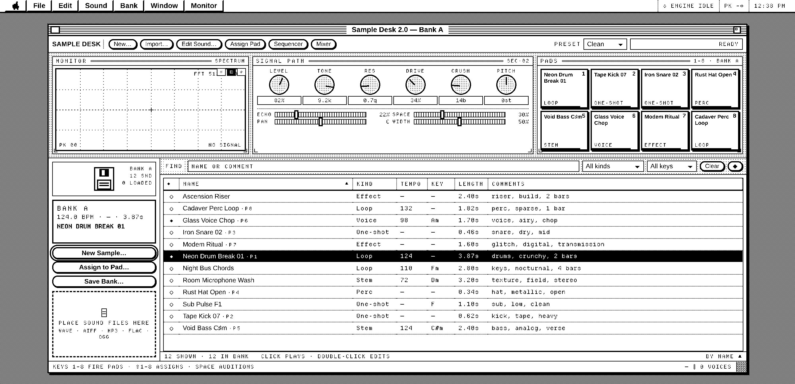
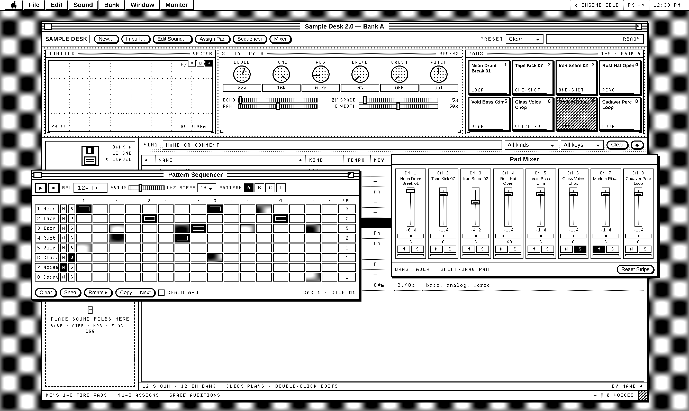
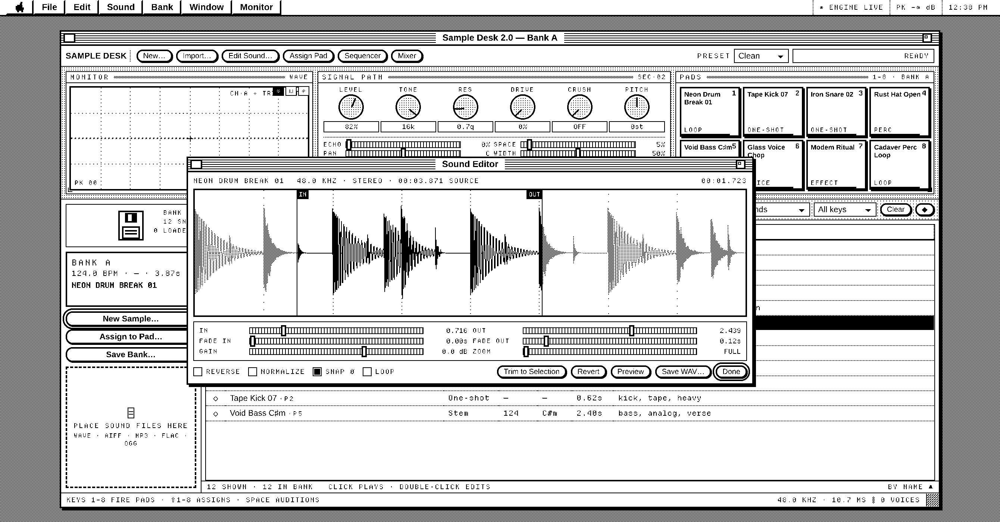

# Sample Desk 2.0

A self-contained, one-bit sample workstation that runs from a single HTML file.
It organises, plays, sequences, mixes and edits music-production stems, loops,
one-shots, vocals and effects.

The interface follows the Macintosh System 6 / early System 7 visual language —
dithered desktop, pull-down menu bar, striped window title bars, close and zoom
boxes, pill buttons, period alert dialogs — with the instrumentation inside the
panels pushed toward a minimal-futurist register: pixel-monospace readouts,
letterspaced machine labels, serial codes, registration marks and reticles.

**▶ [Open it in your browser](https://numbpill3d.github.io/sample-desk/)** — no install, no build, nothing leaves your tab.



**Strictly one bit.** The only two colours in the entire file are `#000` and
`#fff`. Every apparent grey is a CSS dither pattern, the way the original
hardware did it:

```bash
grep -oE '#[0-9a-fA-F]{3,6}' index.html | sort -u    # → #000 #fff
```

## Run

The hosted copy is at **https://numbpill3d.github.io/sample-desk/**.

To run it yourself, open `index.html` directly in a browser, or serve it locally:

```bash
cd /home/scorn/retro-stem-terminal
python3 -m http.server 8765
```

Then visit http://127.0.0.1:8765/.

## Menus

The menu bar is live. **File · Edit · Sound · Bank · Window · Monitor** carry
real commands with their keyboard equivalents, checkmarks on toggles, and
dimmed items when a command does not currently apply.

## Library

- Drop audio files anywhere on the desk, or use `Import…` (`⌘I`).
  WAVE, AIFF, MP3, FLAC, OGG, M4A and Opus are read through the browser decoder.
- Kind, tempo and key are guessed from the filename on import and can be edited.
- Click a sound to select and audition it; double-click to open its information.
- Sort by any column; filter with Find, Kind, Key, and the ◆ marked-only toggle.
- `↑`/`↓` walk the list, `⌘D` duplicates, `Delete` removes, `⌘M` marks.

## Pads and mixer

- Eight pads. Press `1`–`8` to fire, `⇧1`–`⇧8` to assign the selected sound,
  `⌥`-click a pad to clear it, right-click to mute it.
- The **Pad Mixer** window gives each pad a level fader, pan, mute and solo,
  with a live trigger lamp per channel.
- Retriggering a pad chokes its previous voice, so hats and loops behave.

## Pattern sequencer



An 8-track × 16-step sequencer driven by a lookahead scheduler: a timer wakes
every 25 ms and places upcoming steps directly on the audio clock, so timing is
sample-accurate rather than subject to `setInterval` drift.

- Click a step to cycle off → normal → accent; drag across the grid to paint.
- Tempo 40–240 BPM, swing on the off-sixteenths, pattern length 4/8/12/16.
- Four patterns, A–D, with copy-forward and optional chaining.
- `Return` starts and stops it from anywhere.

## Signal path

Each voice gets its own chain — gain → filter → drive → bit-crush → pan —
splitting into a dry path and a send to a shared effects bus, so live knob
moves affect sounding notes.

- **Level, Tone, Res, Drive, Crush, Pitch** knobs. Drag vertically, `⇧` for
  fine, wheel to nudge, double-click to snap back to the preset value.
- **Echo** is a cross-fed stereo delay; **Space** is a convolution reverb built
  from a procedurally generated impulse response; plus **Pan** and **Width**.
- The master bus ends in a limiter, so nothing clips on the way out.
- Presets: Clean, Tape, Transmit, Dub Echo, Overdrive, Cathedral, Vacuum.

## Monitor

Three modes, switchable from the panel or the **Monitor** menu:

- **Waveform** — trigger-stabilised oscilloscope with a held trace and peak.
- **Spectrum** — logarithmically binned FFT drawn as dithered columns.
- **Vectorscope** — mid/side at the classic 45°, for checking stereo width.

## Sound editor



- Drag on the waveform to select; grab the **IN** or **OUT** marker to nudge one
  edge; double-click to select the whole sound; wheel to zoom.
- In and out points snap to the nearest zero crossing (hold `⇧` to override).
- Fade in, fade out, gain trim, reverse, normalize, and loop preview with a
  running playhead.
- `Trim to Selection` bakes the edit into the sound; `Revert` restores it.
- `Save WAV…` writes a standard 24-bit PCM WAV for Ableton Live, LMMS, Reaper
  and anything else that reads WAVE.

Edits are non-destructive and memoised: the edited buffer is rebuilt only when
a parameter actually changes.

## Factory sounds

The twelve factory sounds are not recordings and not sine stacks — each is
rendered from scratch by a small synthesis engine (kick, snare, hat, bass,
chord, vocal-formant, riser, wash, glitch) at the audio context's own sample
rate, with the drum loops sequenced from those voices. The desk therefore
sounds like an instrument on the first click, with no media files to ship.

## Saving

The bank, pad map, mixer, patterns and signal path are saved to this browser's
local storage as you work, and restore on the next visit. `Save Bank…` (`⌘S`)
writes the same thing to a JSON file; `Open Bank…` (`⌘O`) reads one back.

Factory sounds rebuild exactly from their recipe. **Imported audio does not
survive a reload** — the decoded samples live only in the tab's memory, and a
restored bank marks those entries as needing re-import rather than pretending
they are still there. Nothing is ever uploaded.

## Key map

The full map lives in **Window → Key Map**; the essentials sit in the status
bar. In short: `1`–`8` fire pads, `⇧1`–`⇧8` assign, `Space` auditions, `Return`
runs the sequencer, `⌘.` stops every voice, `Esc` closes the front window.

## Self-test

Screenshots cannot hear silence, so the audio path has its own test. Open
`index.html?selftest` (or run it headless) to render the complete voice chain
through an `OfflineAudioContext` and assert that it produces signal, that the
trim and normalize maths are exact, that the WAV header is well-formed, and
that a bank survives a serialise/restore round trip:

```bash
chromium --headless --disable-gpu --virtual-time-budget=25000 --dump-dom \
  'file://'"$PWD"'/index.html?selftest' | tail -20
```

Headless note: the offline render sometimes finishes after Chromium has already
dumped the page, so on a loaded machine a run may come back with no summary.
That is the harness racing the test, not a failure — retry, or just open
`index.html?selftest` in a real browser, where it always completes.

## Preserved versions

- `index-v3-mac.html` — Sample Desk 1.1, the single-window System 6 design.
- `index-v2-classic.html` — Sample Desk 1.0, before the studio-audio upgrade.
- `index-v1-terminal.html` — the original dark terminal-style concept.
